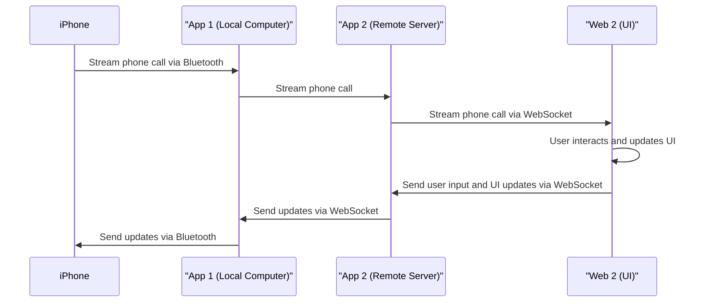

## Development Guide for Audio Streaming from an iPhone to Ubuntu VPS using ESP32 Bluetooth Module

### Introduction

This document provides a comprehensive development guide for streaming audio from an iPhone to a Ubuntu Virtual Private Server (VPS) via a Windows Laptop using an ESP32 Bluetooth module. The key components of the process are the iPhone, a Windows laptop running the Arduino application, an ESP32 Bluetooth module, and the Ubuntu VPS.

The overall process will involve:

1. Pairing the iPhone to the ESP32 module, which is connected to the laptop.
2. Using the Arduino application on the laptop to take the audio from the iPhone via Bluetooth, adapt it to a WebSocket format, and send it to the Ubuntu VPS.
3. The VPS receiving the WebSocket audio stream.
4. Reversing the process to send audio from the VPS to the iPhone.

### Prerequisites

* iPhone with Bluetooth capability
* ESP32 Bluetooth module
* Windows laptop with Bluetooth, Arduino IDE installed
* Ubuntu VPS with internet access
* Basic knowledge in Arduino programming, WebSocket protocol, and Ubuntu server management

### Set Up the Hardware

#### 1. Setting up the ESP32 Module

To set up the ESP32 module, connect it to your laptop using a micro-USB cable.

### Set Up the Software

#### 1. Arduino IDE

First, ensure that you have the latest version of Arduino IDE installed on your Windows laptop. If not, download it from the [official Arduino website](https://www.arduino.cc/en/main/software) and install it.

#### 2. ESP32 Arduino Core

To program the ESP32 module, you will need to install the ESP32 core for Arduino. Follow the instructions in this [official guide](https://github.com/espressif/arduino-esp32/blob/master/docs/arduino-ide/boards_manager.md) to add it to your Arduino IDE.

#### 3. Bluetooth Libraries

To handle Bluetooth communication on the ESP32 module, we'll use the built-in `BluetoothSerial` library that comes with the ESP32 core. This will allow us to establish a serial communication link with the iPhone.

### Configure the ESP32 Module and the Arduino Application

#### 1. Pairing the iPhone with the ESP32 Module

Create an Arduino sketch to setup the ESP32 as a Bluetooth device that the iPhone can pair with.

```cpp
#include "BluetoothSerial.h"

BluetoothSerial SerialBT;

void setup() {
  Serial.begin(115200);
  SerialBT.begin("ESP32Test"); // Give your ESP32 a name
}

void loop() {
  if (Serial.available()) {
    SerialBT.write(Serial.read());
  }
  if (SerialBT.available()) {
    Serial.write(SerialBT.read());
  }
  delay(20);
}
```

Upload this sketch to the ESP32 module. Once the sketch is uploaded, the ESP32 should be visible to your iPhone. Pair your iPhone with the ESP32 module.

#### 2. Arduino WebSocket Server

For the Arduino application to be able to send and receive WebSocket data, it must be set up as a WebSocket server. There are various Arduino WebSocket libraries available, such as the ArduinoWebsockets library. You can install it via the Arduino Library Manager.

The Arduino sketch for setting up a WebSocket server on the ESP32 might look like this:

```cpp
#include <ArduinoWebsockets.h>
#include <BluetoothSerial.h>

using namespace websockets;

BluetoothSerial SerialBT;
WebsocketsServer server;

void setup() {
  Serial.begin(115200);
  SerialBT.begin("ESP32Test");

  server.listen(8080);
  server.onConnection([](WebsocketsClient& client) {
    client.onMessage([](WebsocketsClient& client, WebsocketsMessage message) {
      // Handle incoming WebSocket messages here
    });
  });
}

void loop() {
  if (Serial.available()) {
    SerialBT.write(Serial.read());
  }
  if (SerialBT.available()) {
    Serial.write(SerialBT.read());
  }
  server.poll();
  delay(20);
}
```

This is a basic WebSocket server setup. The server will listen for WebSocket connections on port 8080. You'll need to handle incoming WebSocket messages in the provided `onMessage` callback.

### Set Up the Ubuntu VPS

To receive the audio data on your Ubuntu VPS, you'll need a WebSocket client. There are several options available, such as Node.js with the `ws` library, or Python with the `websocket` library. The following example is a basic setup using Node.js.

First, install Node.js and npm on your Ubuntu VPS. You can use the following commands:

```bash
sudo apt update
sudo apt install nodejs npm
```

Next, install the `ws` library using npm:

```bash
npm install ws
```

Then, create a new file named `ws-client.js` and add the following code:

```javascript
const WebSocket = require('ws');

const ws = new WebSocket('ws://your-arduino-ip:8080');

ws.on('open', function open() {
  ws.send('Hello from the VPS!');
});

ws.on('message', function incoming(data) {
  // Handle incoming WebSocket data here
});
```

This will connect to the Arduino WebSocket server and handle incoming WebSocket data.

Finally, run your WebSocket client with the following command:

```bash
node ws-client.js
```

This sets up the basic infrastructure for your audio streaming. To send and receive actual audio data, you'll need to further process the data according to the audio format you're using (e.g., WAV, MP3, etc.). This might involve additional encoding and decoding steps, both on the Arduino side and on the Ubuntu VPS side.

### Wrapping up

With the basic setup complete, you now need to build upon this to meet your specific audio requirements. Please note that handling real-time audio data over WebSocket might be complex and may require additional buffering and synchronization mechanisms.

Feel free to adapt this guide as needed, and make sure to thoroughly test your setup to ensure stable audio streaming.
