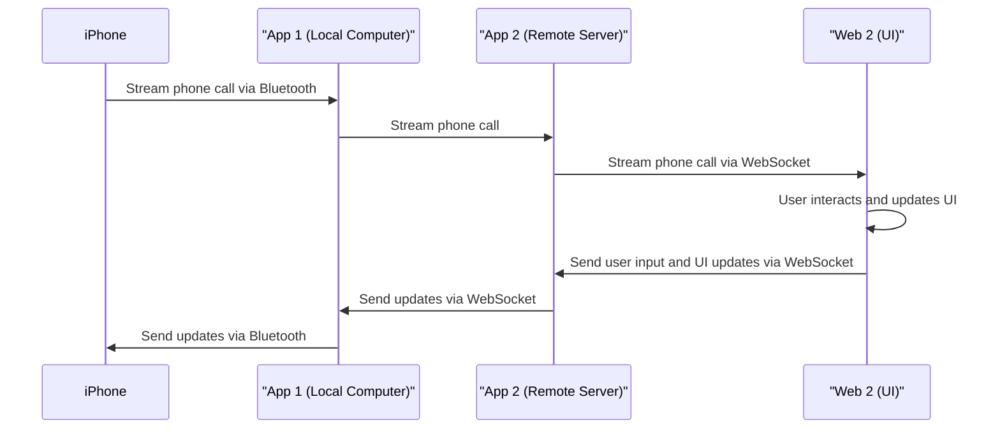

# BluetoothConnector

Simple macOS app to connect a Bluetooth device and stream audio over websocket.

## Usage

To connect a device and stream audio:

```
BluetoothConnector --connect 00:00:00:00:00:00 --websocket wss://localhost:8080
```

This will:

- Connect to the device via Bluetooth 
- Stream audio from the device over a websocket connection
- Audio will be encoded using Opus codec

To stream audio back to device:

```
BluetoothConnector --connect 00:00:00:00:00:00 --websocket wss://localhost:8080 --stream-back
```

This will also stream any audio received over the websocket back to the device after decoding it.

A remote device can connect to the websocket endpoint to receive and send audio.

## Installation

```
swift package update
swift build
```

## Implementation

- Uses IOBluetooth to connect to devices
- Encodes Bluetooth audio with Opus  
- Sends and receives audio over websocket
- Decodes received audio back to raw format

## Notification Support

Can send desktop notifications on connect/disconnect.

```
BluetoothConnector --notify ...
``` 

## Automator Service

Includes an Automator workflow to bind a keyboard shortcut.
