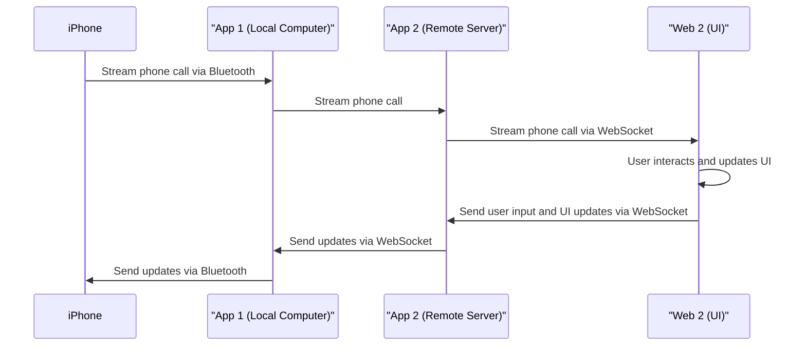

## Development Guide for Audio Streaming from an iPhone to Ubuntu VPS using Laptop's Bluetooth

### Introduction

This document presents a comprehensive guide for developing a system that streams audio from an iPhone to an Ubuntu Virtual Private Server (VPS) via a Windows Laptop's built-in Bluetooth. The main components involved in this process are the iPhone, a Windows laptop with Bluetooth and Arduino software, and an Ubuntu VPS.

The general steps include:

1. Pairing the iPhone to the laptop via Bluetooth.
2. Utilizing the Arduino software to adapt the audio from the iPhone to a WebSocket format and send it to the Ubuntu VPS.
3. Having the VPS receive the WebSocket audio stream.
4. Reversing the process to send audio from the VPS to the iPhone.

### Prerequisites

* An iPhone with Bluetooth capability
* A Windows laptop with Bluetooth and the Arduino IDE installed
* Basic understanding of Arduino programming and WebSocket protocol

### Set Up the Software

#### 1. Arduino IDE

Ensure you have the latest version of Arduino IDE installed on your Windows laptop. If not, download it from the [official Arduino website](https://www.arduino.cc/en/main/software) and install it.

#### 2. Laptop Bluetooth Handling in Arduino

To communicate with the iPhone via Bluetooth, we'll use the Windows Bluetooth API in the Arduino software.

You will need to install a library that allows Arduino to interface with the Windows Bluetooth API. One such library is [BtSerial Pro](https://www.megunolink.com/articles/category/arduino/). This will allow the Arduino software to establish a serial communication link with the iPhone.

### Configure the Laptop and Arduino Software

#### 1. Pairing the iPhone with the Laptop

Before proceeding, pair your iPhone with the laptop via Bluetooth in the usual way using the Bluetooth settings on both devices. Make sure they recognize each other and can communicate.

#### 2. Arduino WebSocket Server

For the Arduino application to be able to send and receive WebSocket data, it must be set up as a WebSocket server. There are several WebSocket libraries available for Arduino, such as the ArduinoWebsockets library. You can install it via the Arduino Library Manager.

Here's a basic sketch for setting up a WebSocket server:

```cpp
#include <ArduinoWebsockets.h>
#include <BtSerialPro.h>

using namespace websockets;

BtSerialPro SerialBT;
WebsocketsServer server;

void setup() {
  Serial.begin(115200);
  SerialBT.begin();

  server.listen(8080);
  server.onConnection([](WebsocketsClient& client) {
    client.onMessage([](WebsocketsClient& client, WebsocketsMessage message) {
      // Handle incoming WebSocket messages here
    });
  });
}

void loop() {
  if (Serial.available()) {
    SerialBT.write(Serial.read());
  }
  if (SerialBT.available()) {
    Serial.write(SerialBT.read());
  }
  server.poll();
  delay(20);
}
```

This script sets up a basic WebSocket server listening on port 8080. You will handle incoming WebSocket messages in the provided `onMessage` callback.


### Conclusion

This guide provides the foundational steps for streaming audio from an iPhone to an Ubuntu VPS via a Windows laptop's Bluetooth and WebSocket technology. As handling real-time audio data over WebSocket can be complex, further processing may be needed, such as additional buffering and synchronization mechanisms. Feel free to adapt this guide according to your specific needs, and ensure to thoroughly test your system to ensure stable audio streaming.
